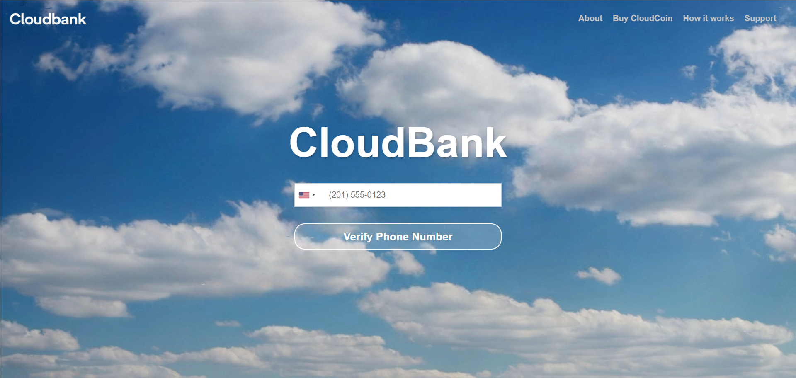
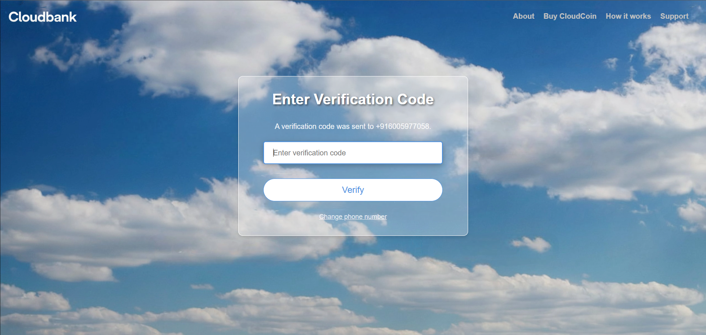
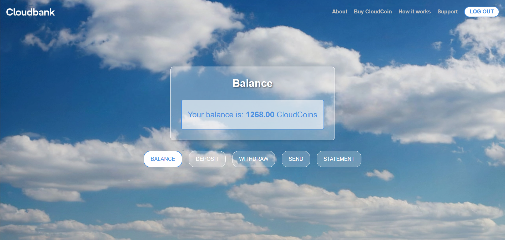
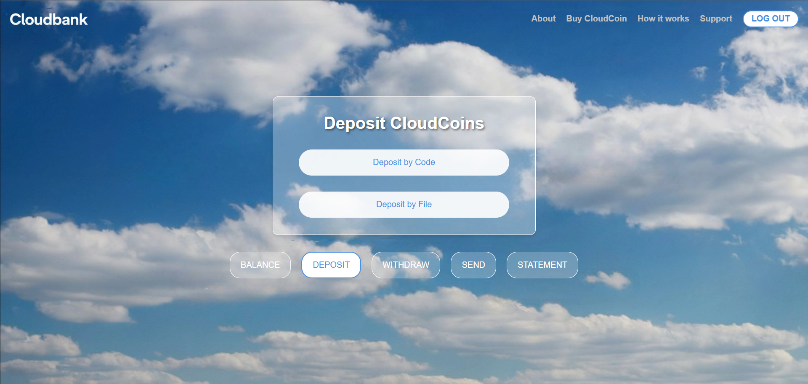
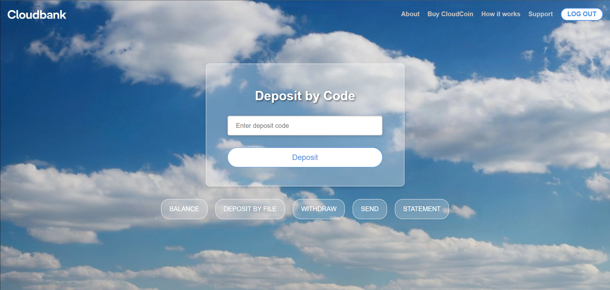
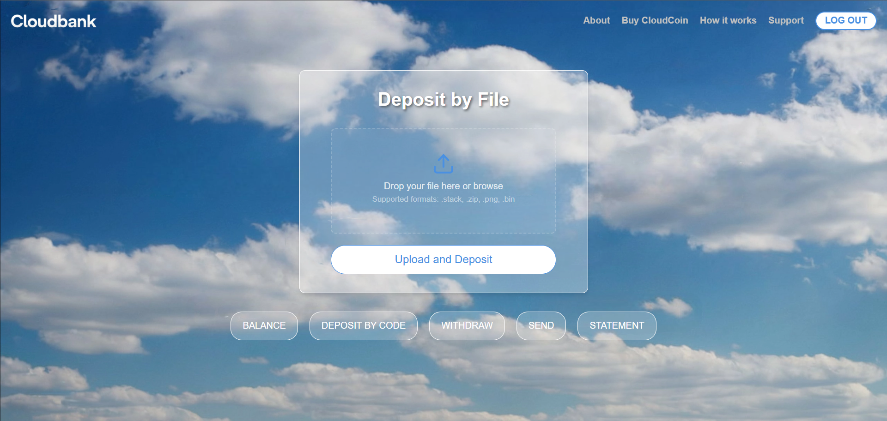
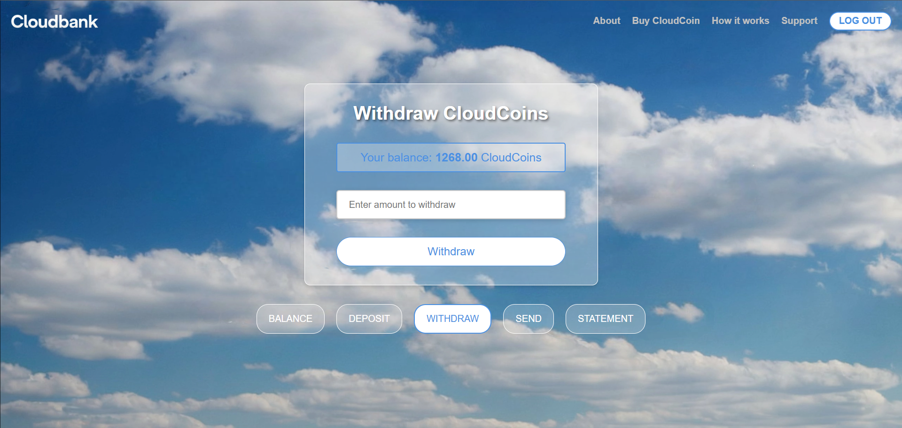
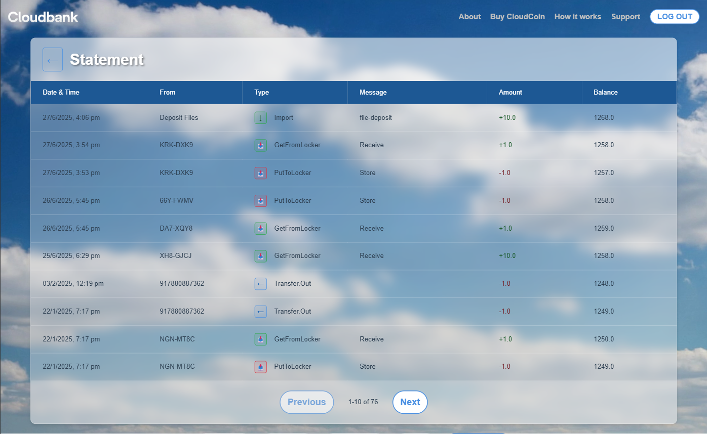

# CloudBank

CloudBank is a PHP-based web application that provides a simple interface for managing CloudCoin wallets. It allows users to check their balance, deposit, withdraw, and send CloudCoins. This is a true digital bank and holds digital cash. It requires a bank account and it uses the person's phone number as the account number. This bank uses the QSockets API to handle coins including the authentication, making change, and healing (if necessary). 

You can see this code in action and infact use it to store and transfer your CloudCoins: https://cloudcoin.com/cloudbank

## Features

CloudBank provides a secure and user-friendly interface for managing your CloudCoins through the following features:

### Phone Number Authentication
The application uses your phone number as your account identifier, providing a simple and secure way to access your wallet.


*Enter your phone number to get started with CloudBank*

### SMS Verification
For security, CloudBank sends a verification code to your phone number to ensure account authenticity.


*Enter the verification code sent to your phone*

### Wallet Dashboard
Once authenticated, you can access your complete wallet dashboard with all essential banking functions.


*Your CloudBank dashboard showing balance and available actions*

### Deposit Options
CloudBank offers flexible deposit methods to add CloudCoins to your wallet.


*Choose between depositing by code or uploading a file*

#### Deposit by Code
Enter a CloudCoin deposit code to instantly add coins to your wallet.


*Simple code-based deposit interface*

#### Deposit by File
Upload CloudCoin files in various formats including .stack, .zip, .png, and .bin files.


*Drag and drop file upload for CloudCoin deposits*

### Withdraw CloudCoins
Easily withdraw CloudCoins from your wallet by specifying the amount you want to extract.


*Withdraw interface showing current balance and amount input*

### Send to Other Users
Transfer CloudCoins to other CloudBank users using their phone numbers.


*Send CloudCoins by entering recipient's phone number and amount*

### Transaction History
View a complete record of all your CloudCoin transactions with detailed information.


*Comprehensive transaction history with dates, amounts, and running balance*

### Core Banking Functions

* **Wallet Management:** Create and manage CloudCoin wallets.
* **Balance Inquiry:** Check your current CloudCoin balance.
* **Deposit:** Deposit CloudCoins into your wallet using a code or a file.
* **Withdraw:** Withdraw CloudCoins from your wallet.
* **Send:** Transfer CloudCoins to other users.
* **Transaction History:** View a list of your past transactions.

## Project Structure

The project is organized into the following main directories:

* `/assets`: Contains static files like CSS, JavaScript, and images.
* `/config`: Holds configuration files, including API keys.
* `/controllers`: Contains the business logic for handling user requests.
* `/includes`: Shared PHP files, like common head content.
* `/logs`: Stores log files for debugging.
* `/models`: Contains the data models and services for interacting with the CloudBank API.
* `/twilio`: Holds the Twilio SDK for SMS-based phone verification.
* `/vendor`: Composer dependencies.
* `/uploads`: Directory for file uploads.
* `/utils`: Utility functions and classes.
* `/views`: Contains the presentation layer (HTML and PHP templates).

## Getting Started

### Prerequisites

* PHP 7.4 or higher
* Composer
* A web server (like Apache or Nginx)
* A Twilio account for phone verification

### Installation

1.  **Clone the repository:**
    ```bash
    git clone [https://github.com/CloudCoinVersion3/cloudbank.git](https://github.com/CloudCoinVersion3/cloudbank.git)
    cd cloudbank
    ```

2.  **Install dependencies:**
    ```bash
    composer install
    ```

3.  **Configure your environment:**
    * Create a file `api_keys.toml` in the `config` directory .
    * Add your Twilio credentials to `config/api_keys.toml`.
    * Make sure to provide the correct path to your `api_keys.toml` in the `config/config.php` file.

4.  **Set up your web server:**
    * Point your web server's document root to the project's public directory.
    * Ensure that `mod_rewrite` (for Apache) is enabled.

### Usage

1.  Open the application in your web browser.
2.  Verify your phone number to create a wallet.
3.  Once authenticated, you can use the navigation to access the different features.

## API Integration

The application communicates with a backend CloudBank API. The core API logic is handled by the `models/CloudBankAPI.php` class. For more details on the API, see the `models/README.md` file.

## Contributing

Contributions are welcome! Please feel free to submit a pull request.

## License

This project is licensed under the MIT License - see the [LICENSE.md](LICENSE.md) file for details.